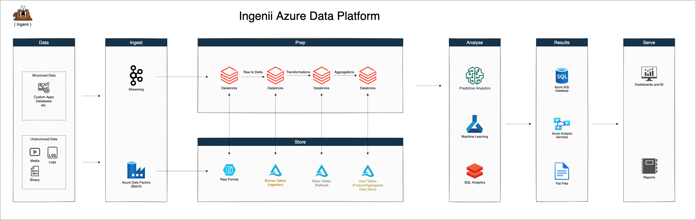

# Ingenii Azure Data Platform



## Introduction

The data landscape today can be considered a rich ecosystem of tools and services. You no longer need to depend on expensive and proprietary technologies to collect and analyze data. Open source tools are as good, if not better, than commercial software. Cloud providers have made it easy to build cost-effective and scale on-demand solutions with zero capital investment. It has never been this easy to analyze data!

The solution you have in your hands is built to take advantage of the latest technologies.

At the core of the infrastructure, we have [Azure Databricks](https://docs.microsoft.com/en-us/azure/databricks/scenarios/what-is-azure-databricks) analyzing and processing data.
[Azure Data Factory](https://azure.microsoft.com/en-us/services/data-factory/) is responsible for data orchestration. [Azure Data Lake](https://azure.microsoft.com/en-us/solutions/data-lake/), alongside the [Delta Lake layer](https://delta.io), are providing us with infinite scale storage.

The platform support ingestion for structured, semi-structured, or unstructured data via numerous sources, some of which are: APIs, SFTP, Amazon S3, etc.

Last but not least, we have spent a lot of time thinking about how to automate the deployment of these tools and services. The current repository is the result of our hard work. We use Terraform, Terragrunt, GitHub Workflows, etc., to deliver a fully automated platform that is easy to deploy and maintain.

Our documentation section can help you navigate around and make yourself familiar with the platform.

## Documentation

- [Getting Started](#getting-started)
- [Requirements](./docs/platform_requirements.md)
- [Platform Design](./docs/platform_design.md)
- [YAML Configuration Schema](./docs/yaml_config_schema.md)
- [FAQ](./docs/faq.md)
- [Troubleshooting](./docs/troubleshooting.md)

## Getting Started

Before you start, please review the [platform requirements](./docs/platform_requirements.md). Make sure to have all credentials prepared.

### Prerequisites

- Terraform 1.0.0
- Terragrunt 0.30.7 or above
- yq 4.9.6 or above
- git 2.30.2 or above
- Azure CLI 2.18.0 or above

Alternatively, we maintain a Docker Image with all requirements installed:

- [DockerHub](https://hub.docker.com/r/ingeniisolutions/terraform-runtime)
- [GitHub](https://github.com/ingenii-solutions/terraform-runtime)

### Initialize The Platform Repository

```shell
# Set your GitHub personal access token
export GITHUB_TOKEN=""

# Set the platform version to initialize
export PLATFORM_VERSION=""

# Run Init Script
sh -c "$(wget --header="Authorization: token ${GITHUB_TOKEN}" -O - \
https://raw.githubusercontent.com/ingenii-solutions/azure-data-platform/main/src/utils/scripts/init-platform.sh)"
```

### Update The Platform Version

```shell
# Set your GitHub personal access token
export GITHUB_TOKEN=""

# Set the platform version to initialize
export PLATFORM_VERSION=""

# Run Update Script
sh -c "$(wget --header="Authorization: token ${GITHUB_TOKEN}" -O - \
https://raw.githubusercontent.com/ingenii-solutions/azure-data-platform/main/src/utils/scripts/update-platform.sh)"
```

## Dependencies

### Docker Images

- Databricks Runtime Image - Used by the Databricks Clusters as an execution environment. The image contains useful binaries.
  - [DockerHub](https://hub.docker.com/r/ingeniisolutions/data-platform-databricks-runtime)
  - [GitHub](https://github.com/ingenii-solutions/data-platform-databricks-runtime)
