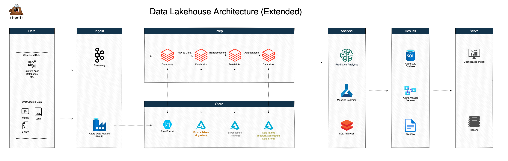

# Ingenii Azure Data Platform



Table of Contents

- [Ingenii Azure Data Platform](#ingenii-azure-data-platform)
  - [Getting Started](#getting-started)
    - [Prerequisites](#prerequisites)
    - [Initialize The Platform Repository](#initialize-the-platform-repository)
    - [Update The Platform Version](#update-the-platform-version)
  - [YAML Configuration Schema](#yaml-configuration-schema)
  - [Dependencies](#dependencies)
    - [Docker Images](#docker-images)

## Getting Started

### Prerequisites

- Terraform 1.0.0
- Terragrunt 0.30.7 or above
- yq 4.9.6 or above
- git 2.30.2 or above
- Azure CLI 2.18.0 or above

Alternatively, we maintain a Docker Image with all requirements installed:

- [DockerHub](https://hub.docker.com/r/ingeniisolutions/terraform-runtime)
- [GitHub](https://github.com/ingenii-solutions/terraform-runtime)

### Initialize The Platform Repository

```shell
# Set your GitHub personal access token
export GITHUB_TOKEN=""

# Set the platform version to initialize
export PLATFORM_VERSION=""

# Run Init Script
sh -c "$(wget --header="Authorization: token ${GITHUB_TOKEN}" -O - \
https://raw.githubusercontent.com/ingenii-solutions/azure-data-platform/main/src/utils/scripts/init-platform.sh)"
```

### Update The Platform Version

```shell
# Set your GitHub personal access token
export GITHUB_TOKEN=""

# Set the platform version to initialize
export PLATFORM_VERSION=""

# Run Update Script
sh -c "$(wget --header="Authorization: token ${GITHUB_TOKEN}" -O - \
https://raw.githubusercontent.com/ingenii-solutions/azure-data-platform/main/src/utils/scripts/update-platform.sh)"
```

## YAML Configuration Schema

Our config schema can be found here:
[YAML Configuration Schema](./docs/yaml_config_schema.md)

## Dependencies

### Docker Images

- Databricks Runtime Image - Used by the Databricks Clusters as an execution environment. The image contains useful binaries.
  - [DockerHub](https://hub.docker.com/r/ingeniisolutions/data-platform-databricks-runtime)
  - [GitHub](https://github.com/ingenii-solutions/data-platform-databricks-runtime)
