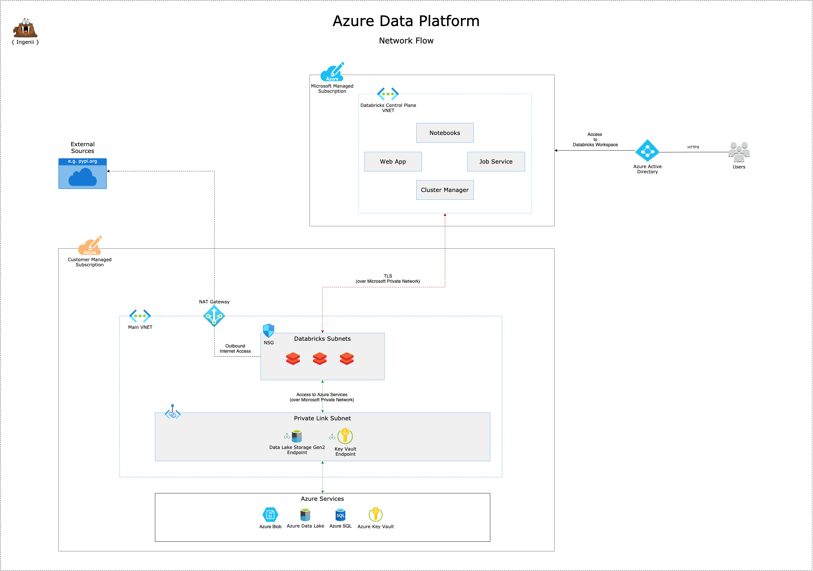

# Solution Design

**Table of Contents**

- [Solution Design](#solution-design)
  - [Introduction](#introduction)
  - [Customer Requirements](#customer-requirements)
  - [Modular Infrastructure](#modular-infrastructure)
  - [Environments](#environments)
    - [Data Sharing (Shared -> DTAP)](#data-sharing-shared---dtap)
    - [Data Sharing (Same Environment)](#data-sharing-same-environment)
  - [Network](#network)
    - [Network Flow](#network-flow)
  - [Infrastructure As Code](#infrastructure-as-code)
    - [Code Structure](#code-structure)
  - [Cloud Costs](#cloud-costs)
    - [Network](#network-1)

## Introduction

TBD

## Customer Requirements

- Azure Service Principal
- Azure Subscription(s)

## Modular Infrastructure


## Environments


### Data Sharing (Shared -> DTAP)


### Data Sharing (Same Environment)


## Network

### Network Flow



## Infrastructure As Code

### Code Structure

```shell
├── Makefile                  # Helper functions
├── README.md                 # Main README file
├── configs                   # Client specific configs
│   ├── dev.yml               # Development environment-specific configs
│   ├── globals.yml           # Global configs (applying to DTAP/Shared environments)
│   ├── prod.yml              # Production environment-specific configs
│   ├── shared.yml            # Shared environment-specific configs
│   └── test.yml              # Test environment-specific configs
├── docs                      # Platform documentation
│   └── assets                # Documentation assets such as images, files etc
└── src                       # Platform source code
    ├── env                   # All environment configs
    │   ├── dtap              # DTAP environment configs
    │   │   ├── defaults.yml  # Default values for the DTAP environments
    │   │   ├── env.hcl       # Environment (DTAP) specific Terragrunt configs
    │   ├── root.hcl          # Global Terragrunt configs. (DTAP/Shared)
    │   └── shared            # Shared environment configs
    │       ├── defaults.yml  # Default values for the Shared environment
    │       └── env.hcl       # Environment (Shared) specific Terragrunt configs
    ├── modules               # Pure Terraform code
    └── terragrunt.hcl        # Base Terragrunt file
```

## Cloud Costs

### Network

- [Azure Bandwidth Pricing](https://azure.microsoft.com/en-us/pricing/details/bandwidth/)
- [Azure Virtual Network Pricing](https://azure.microsoft.com/en-gb/pricing/details/virtual-network/)
