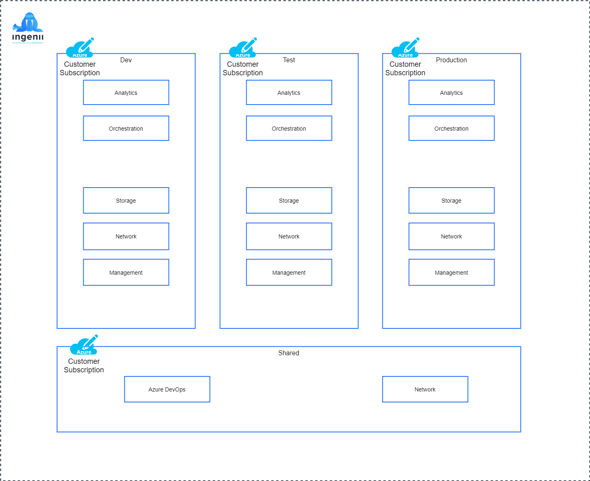

# Ingenii Azure Data Platform Design <!-- omit in toc -->

**Table of Contents**

- [Overview](#overview)
- [Architectural Design](#architectural-design)
  - [Azure Subscriptions](#azure-subscriptions)
  - [Azure Resource Groups](#azure-resource-groups)
  - [Network Flow](#network-flow)
  - [Data Flow](#data-flow)
  - [Infrastructure Environments](#infrastructure-environments)
- [Infrastructure As Code](#infrastructure-as-code)
  - [Code Structure](#code-structure)
  - [IaC Design](#iac-design)
- [Costs](#costs)
  - [Network](#network)

## Overview


## Architectural Design


### Azure Subscriptions


### Azure Resource Groups

TODO

### Network Flow


### Data Flow

TODO

### Infrastructure Environments



## Infrastructure As Code

### Code Structure

TODO

```shell
├── Makefile                  # Helper functions
├── README.md                 # Main README file
├── configs                   # Client specific configs
│   ├── dev.yml               # Development environment-specific configs
│   ├── globals.yml           # Global configs (applying to DTAP/Shared environments)
│   ├── prod.yml              # Production environment-specific configs
│   ├── shared.yml            # Shared environment-specific configs
│   └── test.yml              # Test environment-specific configs
├── docs                      # Platform documentation
│   └── assets                # Documentation assets such as images, files etc
└── src                       # Platform source code
    ├── env                   # All environment configs
    │   ├── dtap              # DTAP environment configs
    │   │   ├── defaults.yml  # Default values for the DTAP environments
    │   │   ├── env.hcl       # Environment (DTAP) specific Terragrunt configs
    │   ├── root.hcl          # Global Terragrunt configs. (DTAP/Shared)
    │   └── shared            # Shared environment configs
    │       ├── defaults.yml  # Default values for the Shared environment
    │       └── env.hcl       # Environment (Shared) specific Terragrunt configs
    ├── modules               # Pure Terraform code
    ├── utils                 # Utilities, scripts, CI workflows
    └── terragrunt.hcl        # Base Terragrunt file
```

### IaC Design

- Terraform `outputs` and their structure act as a contract. Changing the output structure will lead to breaking changes.
- **Local value** names starting with `__` are considered internal to the `local` scope they are defined to.

## Costs

TODO

### Network

- [Azure Bandwidth Pricing](https://azure.microsoft.com/en-us/pricing/details/bandwidth/)
- [Azure Virtual Network Pricing](https://azure.microsoft.com/en-gb/pricing/details/virtual-network/)
