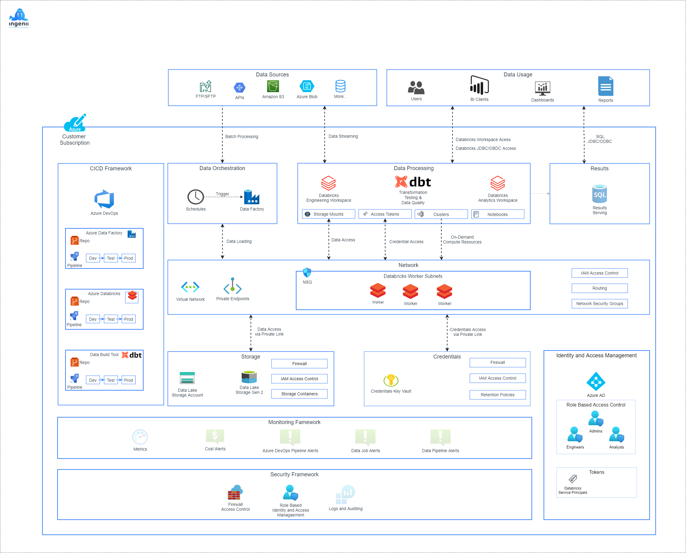

# Ingenii Azure Data Platform Design <!-- omit in toc -->

**Table of Contents**

- [Overview](#overview)
- [Architectural Design](#architectural-design)
  - [Azure Subscriptions](#azure-subscriptions)
  - [Azure Resource Groups](#azure-resource-groups)
  - [Network Flow](#network-flow)
  - [Data Flow](#data-flow)
  - [Infrastructure Environments](#infrastructure-environments)
- [Infrastructure As Code](#infrastructure-as-code)
  - [Code Structure](#code-structure)
  - [IaC Design](#iac-design)
- [Costs](#costs)
  - [Small to Medium Sized Infrastructure Example](#small-to-medium-sized-infrastructure-example)
    - [Compute Resources](#compute-resources)
    - [Storage Resources](#storage-resources)
    - [Bandwidth](#bandwidth)
    - [Total](#total)

## Overview


## Architectural Design



### Azure Subscriptions


### Azure Resource Groups

TODO

### Network Flow


### Data Flow

TODO

### Infrastructure Environments


## Infrastructure As Code

### Code Structure

REDO

```shell
├── Makefile                  # Helper functions
├── README.md                 # Main README file
├── configs                   # Client specific configs
│   ├── dev.yml               # Development environment-specific configs
│   ├── globals.yml           # Global configs (applying to DTAP/Shared environments)
│   ├── prod.yml              # Production environment-specific configs
│   ├── shared.yml            # Shared environment-specific configs
│   └── test.yml              # Test environment-specific configs
├── docs                      # Platform documentation
│   └── assets                # Documentation assets such as images, files etc
└── src                       # Platform source code
```

### IaC Design

TODO

## Costs

> All platform deployments incur a cost of **~$245.00** per month. This includes NAT Gateways, Private Endpoints, Key Vaults etc.
The cost covers all four environments (Dev, Test, Prod, Shared) and its added on top of the Compute, Storage and Bandwidth costs.

### Small to Medium Sized Infrastructure Example

#### Compute Resources

| Item                                                                                                  | Cost (per month) |
| ----------------------------------------------------------------------------------------------------- | ---------------- |
| 1x DS3 v2 (4vCPU, 14GB RAM) Driver Node (Incl. Databricks license) **5 hours per day, 5 days a week** | $70.55           |
| 3x DS3 v2 (4vCPU, 14GB RAM) Worker Node (Incl. Databricks license) **5 hours per day, 5 days a week** | $211.65          |
| **Total Compute**                                                                                     | **$282.20**      |


#### Storage Resources

| Item                                                       | Cost (per month) |
| ---------------------------------------------------------- | ---------------- |
| 500GB Data Lake Storage Gen2 (RA-GRS, Hot, Gen Purpose v2) | $29.45           |
| 10GB Meta-Data Storage                                     | $0.84            |
| Read/Write/Other Operations                                | $15.06           |
| **Storage Cost Total**                                     | **$45.35**       |

#### Bandwidth

| Item                            | Cost (per month) |
| ------------------------------- | ---------------- |
| 200GB Ingress (via NAT Gateway) | $10.00           |
| 10GB Internet Egress            | $0.40            |
| 200GB Privatelink Inbound Data  | $2.00            |
| 200GB Privatelink Outbound Data | $2.00            |
| **Bandwidth Cost Total**        | **$14.4**        |

#### Total

$245.00 (Infrastructure) + $282.20 (Compute) + $45.35 (Storage) + $14.4 (Bandwidth) = **$586.95** per month