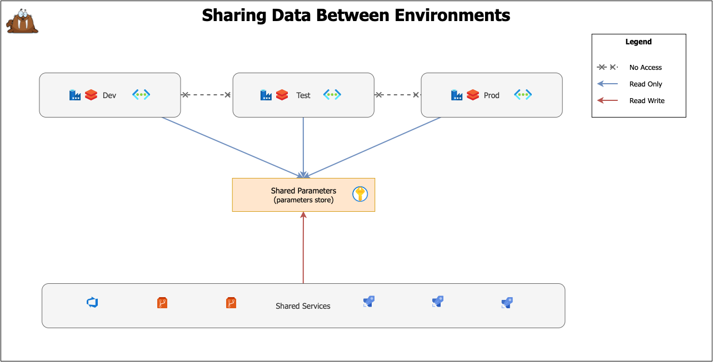
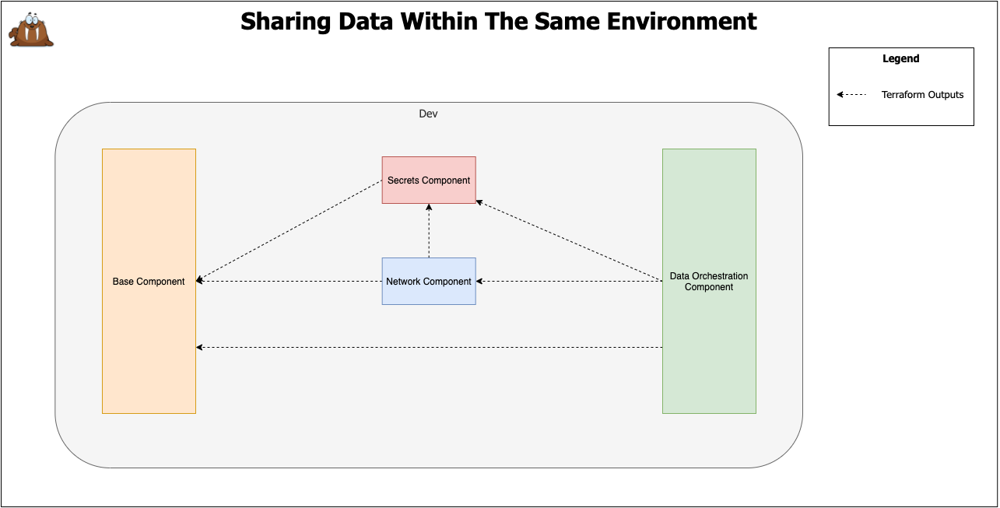

# Solution Design

Table of Contents

- [Solution Design](#solution-design)
  - [Modular Infrastructure](#modular-infrastructure)
  - [Environments](#environments)
    - [Data Sharing (Shared -> DTAP)](#data-sharing-shared---dtap)
    - [Data Sharing (Same Environment)](#data-sharing-same-environment)

## Modular Infrastructure

## Environments

### Data Sharing (Shared -> DTAP)

### Data Sharing (Same Environment)

